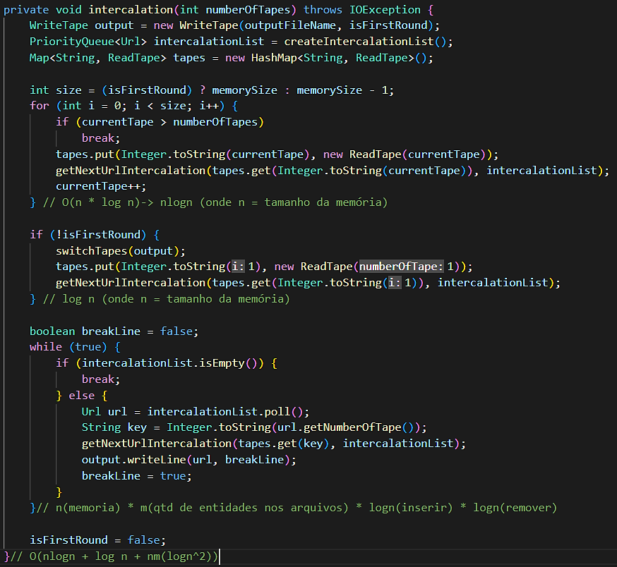

<h1 align="center">
    📼 Fitas
</h1>

## 💻 Grupo

- [Fábio Augusto Araújo Santos](https://github.com/fabio-aug)
- [Luana Assis Silva](https://github.com/luanaassis)

## 📰 Introdução

Desenvolvimento de um ordenador de URLs, que considera a capacidade máxima de memória RAM disponível para realizar a ordenação. Para isso, foi adotada a estratégia de ordenação externa, com o algoritmo QuickSort, onde caso a quantidade de entidades inseridas no arquivo de entrada ultrapasasse a capacidade máxima de memória, as mesmas são divididas em fitas. A inserção das URLs nas fitas ocorre de maneira ordenada, levando em consideração a quantidade de visitas, e caso seja igual, é ordenado alfabeticamente. No final, as fitas já ordenadas são intercaladas ordenadamente, utilizando um Max Heap, e escritas no arquivo de saída.

## 📂 Estrutura

O ambiente de trabalho utilizado foi o Visual Studio Code. Os arquivos foram organizados da seguinte forma:

- `/src`: pasta destinada aos códigos fontes do projeto.
- `/.vscode`: pasta destinada a configuração do projeto caso use a extensão ['Extension Pack for Java'](https://marketplace.visualstudio.com/items?itemName=vscjava.vscode-java-pack).
- `/images`: pasta destinada as imagens do projeto.

Obs: para rodar usando a extensão é necessário algumas alterações no código.

## 🔨 Classes e Métodos

    <strong>Diagrama de classes</strong>
     
    

### App

Classe destinada a receber as informações de entrada (arquivo de entrada, arquivo de saída, memória) e fazer as principais chamadas do projeto.

### Intercalation

Classe responsável pela leitura da fita de entrada, criação de fitas, intercalação de fitas e geração da fita de saída.

- `readInputFile` - Este método é responsável por ler os dados do arquivo de entrada com o auxílio da classe ReadTape. Além disso, nele são instaciadas as classes WriteTape e QuickSortArray, pois é também neste método as entidades são inseridas no array para ordenação, as novas fitas são criadas conforme o parâmetro de capacidade da memória e as URLs já ordenadas são escritas nas fitas.
- `order` - Este método verifica se a fita atual está dentro do intervalo de fitas existentes, e caso sim, chama o método intercalation com o número da fita e ele mesmo novamente.
- `intercalation` - Este método foi criado com o objetivo de facilitar a intercalação entre as URLs de diferentes fitas. Caso seja a primeira passada, ele possui o tamanho máximo de memória para realizar a intercalação, caso não ele possui -1, visto que um espaço já será usado para mesclar as novas fitas com o arquivo que já possui as anteriores mescladas. Utilizando de uma estrutura de HashMap, ele instacia as fitas e adiciona a primeira URL de cada uma na estrutura `PriorityQueue<Url>` chamando o método getNextUrlIntercalation. Logo, ele verifica qual seria a URL com a maior número de visitas, e pega a próxima URL presente na sua respectiva fita e a escreve no arquivo de saída. Quando não é a primeira passada, ele chama o método switchTapes e adiciona o primeiro arquivo novamente no intercalationList.
- `switchTapes` - O objetivo deste procedimento é trocar os dados do arquivo de saída para a primeira fita criada. Este método lê os dados do arquivo de saída, limpa os dados contidos na primeira fita, e a preenche com os dados obtidos no arquivo de saída. Logo após este preenchimento, a fita de saída é limpa.

### QuickSortArray

Classe responsável pela ordenação das fitas criadas. A implementa um array de URLs, onde o tamanho máximo é igual ao tamanho da memória, o método usado pra ordenação é o `QuickSort`, ordenado pela quantidade de número de visitas de um URL e ordem alfabética. Caso o array não esteja completo na hora de ordenar, o mesmo é recriado reduzindo o seu tamanho para evitar possíveis erros.

- `add` - Este método verifica se a lista de URLs está ou não cheia. Caso não, adiciona na lista. Caso sim, altera a flag de que a lista atingiu o seu tamanho máximo.

- `order` - O order realiza uma verificação se a lista não está cheia e não está vazia, e caso sim, chama o método resizeArray. Logo, chama o método de ordenação quickSort.

- `resizeArray` - Este método cria um novo array com o tamanho da quantidades de itens que estão preenchidos na urlList, e depois o reatribui a urlList com a nova propriedade.

### ReadTape

Classe destinada apenas a leitura das fitas. A classe implementa um `Iterable<Url>`, assim a cada linha lida em uma fita é transformada em um objeto da classe URL para a manipulação.

- `readNextLine:` Função responsável por ler a próxima linha de um arquivo usando um interator e retorna uma URL. Após ler uma linha o método seta o número de fita da URL, se a fita for a de output que não possui um valor é atribuído o número 0, caso contrário o valor é o mesmo da fita.

### Url

Classe modelo para a manipulação de URL no projeto, descreve seu formato e funções básicas.

- `fromStringRep:` Função responsável por receber uma entidade em String diretamente de uma fita e retornar um objeto URL.

### WriteTape

Class destinada a criação e escrita em fitas. A classe recebe as informações em objetos da classe URL e transforma em String para a escrita.

- `writeLine:` Método responsável por escrever uma nova linha em uma fita. O método recebe dois parâmetros: uma URL que deseja escrever em uma fita e uma variável boolean para decidir se deve ou não quebrar linha.

- `write:` Método responsável por escrever um conjunto de URLs em uma fita de uma vez. O método recebe como parâmetro um Array de URLs, o método percorre todo o array concatenando e criando apenas um dado de inserção com todas as URLs.

## 🔎 Análise de Complexidade

- `readInputFile` - Este método percorre todas as URLs de uma lista (n) e para cada fita que possui até (n/memória) elementos, ele realiza a ordenação através do QuickSortArray que possui complexidade nlogn no caso médio. Portanto, a complexidade deste método é O(n + (n/tamanhoMemoria)*nlogn).

- `order(Intercalation)` - O método order da classe Intercalation é chamado n vezes, sendo que n é a quantidade de fitas. O método também chama o intercalation recursivamente. Portanto, o método possui a complexidade O(n*(nlogn + log n + nm(logn²)))

- `intercalation` - 

    
Análise de Complexidade do método Intercalation

     
    

- `switchTapes` - O método switchTapes possui a complexidade O(n), onde n é a quantidade de entidades presentes no arquivo de saída (output).

- `add` - O método add da classe QuickSortArray tem a complexidade O(1) pois acessa o index a ser inserido diretamente.

- `order(QuickSortArray)` - O método order da classe QuickSortArray, chama o método recizeArray, que possui complexidade O(n) e o método quickSort que possui complexidade O(nlogn) no caso médio e O(n²) no pior caso. Portanto no caso médio a funcionalidade possui complexidade O(nlogn).

- `resizeArray` - O método recizeArray tem a complexidade O(n), onde n é a quantidade de entidades presentes no urlList. Um adendo é que n neste caso sempre será menor que o tamanho máximo da memória.

- `readNextLine:` A função readNextLine possui a complexidade de O(1). Através de um interator a função verifica a existência de uma próxima linha, caso exista ele retorna e guarda a posição atual, assim seu custo sempre será de O(1).

- `fromStringRep:` A função fromStringRep possui a complexidade de O(1). Pois apenas recebe uma entidade em String por parâmetro e retorna um objeto novo URL.

- `writeLine:` O método writeLine possui a complexidade de O(1). Por se tratar de apenas uma entidade a ser gravada, o método não necessita de nenhum gasto computacional além de acessar o arquivo e gravar a informação.

- `write:` O método write possui a complexidade de O(N), onde N é o tamanho do array de de URLs passadas por parâmetro para função. Como é necessário formar apenas um dado a inserção é necessário percorrer todo o array.

## 🔚 Conclusão

Com a implementação desta solução, aprendemos sobre os princípios e estratégias de ordenação externa. Além disso, aprendemos sobre a aplicação real desta tecnologia com as fitas e sobre a relação do software com a disponibilidade de recursos do hardware.

## 🏃 Instruções para compilação e execução (Apêndice)

- Para compilar o projeto, basta inserir a seguinte linha de comando no terminal dentro da pasta `src`:

      javac .\App.java

- Para executar o projeto, é necessário inicialmente um arquivo com as entidades (URLs e suas respectivas quantidades de visitas) a serem processadas. Este arquivo deve ser incluído na pasta `src`. Após isso, basta inserir a seguinte linha de comando, também dentro da pasta `src`, no terminal para realizar a execução:

      java .\App.java <nomeArquivoEntrada> <nomeArquivoSaida> <tamanhoMemória>
